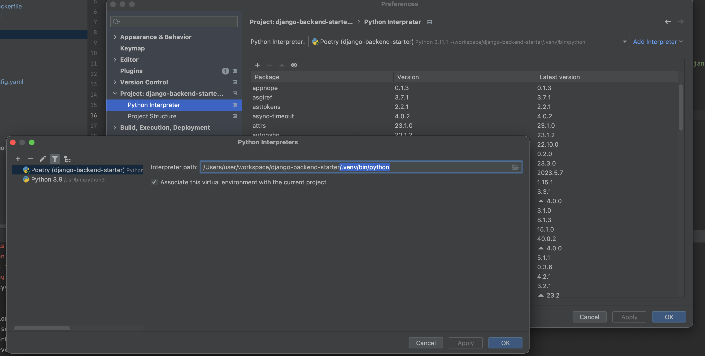
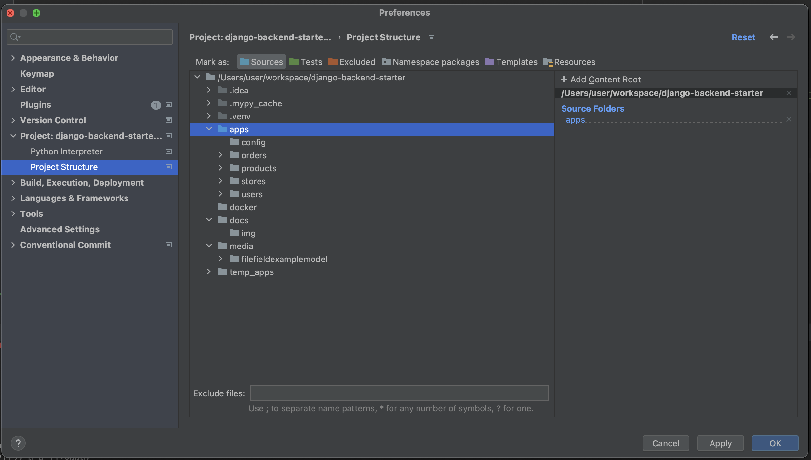
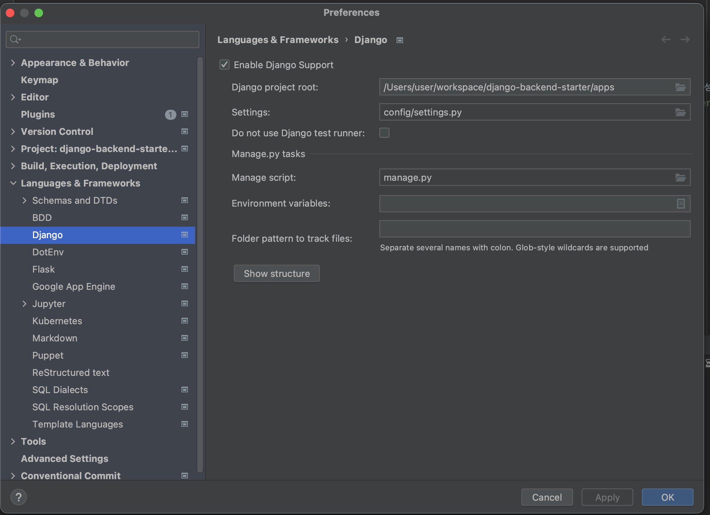
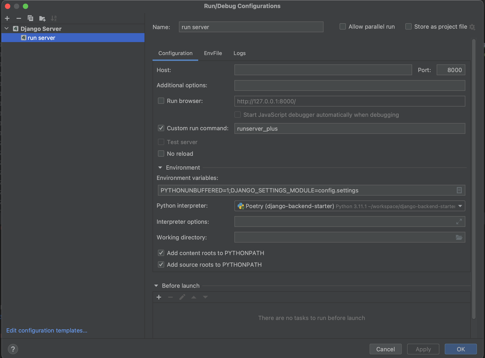

# [백엔드 개발을 위한 핸즈온 장고 ] django-backend-starter
[](https://github.com/pre-commit/pre-commit)
[](https://www.python.org/downloads/release/python-3111/)

[](https://www.djangoproject.com/start/overview/)


* [main](https://github.com/KimSoungRyoul/django-backend-starter/tree/main) : 학습용 예제 프로젝트(활용 가능한 장고 예제 코드를 보여줍니다.)
* [snippet-project](https://github.com/KimSoungRyoul/django-backend-starter/tree/snippet-project): 책 예제 생성용 (일종의 낙서장입니다.)
* [django-backend-starter-template](https://github.com/KimSoungRyoul/django-backend-starter/tree/django-backend-starter-template): backend에 특화된 django project skeleton
    * django startproject 템플릿
    * 원래 장고 공식문서에서는 `django-admin startproject hello_django_project` 로 첫 프로젝트를 생성할것을 가이드하지만
    * 장고 프로젝트 생성시 사용하는 템플릿(--template)은 커스텀이 가능합니다. 아래 커맨드를 사용해서 Backend 개발 환경 설정에 더 특화된 장고 프로젝트를 생성할 수 있습니다.
      ~~~shell
      django-admin startproject --template=https://github.com/KimSoungRyoul/django-backend-starter/archive/django-backend-starter-template.zip  hello_django_project
      ~~~


## django-backend-starter Docs
* https://kimsoungryoul.github.io/django-backend-starter/


## QuickStart

1. Install Docker Desktop
    ~~~
    https://www.docker.com/products/docker-desktop/
    ~~~

2. Install pyenv

    #### MacOS
    ~~~shell
    brew install pyenv
    ~~~

    #### Window
    ~~~shell
    winget install pyenv # (아직 사용불가)

    # winget에서 pyenv 관리 아직 지원 안됨으로 아래 링크의 pyenv-win#quick-start 메뉴얼을 따라갈것
    https://github.com/pyenv-win/pyenv-win#quick-start
    ~~~

3. Install poetry
    * https://python-poetry.org/docs/#installing-with-the-official-installer
    #### MacOS
    ~~~shell
    curl -sSL https://install.python-poetry.org | python3 -
    ~~~

    #### Window (powershell)
    ~~~shell
    (Invoke-WebRequest -Uri https://install.python-poetry.org -UseBasicParsing).Content | py -
    ~~~

4. Infra 를 컨테이너로 전부 올립니다.
    ```shell
    docker compose -f docker/compose.yaml up -d
    ```

5. Install python using pyenv
    ~~~shell
    pyenv install 3.11.1
    ~~~

6. create virtualenv(venv) using poetry & install library
    ~~~shell
    poetry config virtualenvs.in-project true # true이면 .venv 폴더가 프로젝트 하위에 생성됩니다.
    poetry shell
    poetry install
    ~~~

7. django migration
    ~~~shell
    python apps/manage.py migrate
    ~~~

8. django runserver
    * 서버 실행후 http://localhost:8000/api/docs 로 들어가서 API문서를 확인합니다.
    ~~~shell
    python apps/manage.py runserver 8000
    ~~~


## Pycharm django 세팅




