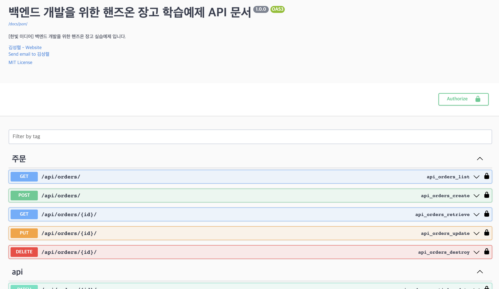

# django-backend-starter

[](https://www.python.org/downloads/release/python-3111/)
[](https://www.djangoproject.com/start/overview/)
[](https://mypy-lang.org/)


[](https://github.com/pre-commit/pre-commit)
[](https://github.com/psf/black)
[](https://pycqa.github.io/isort/)


## [한빛미디어] 백엔드 개발 위한 핸즈온 장고 학습 예제

   

* 학습용 예제 프로젝트(활용 가능한 장고 예제 코드를 보여줍니다)
* 학습용 예제의 경우 간소화를 위해 mypy type check를 100% 지원하지 않습니다.
* [[한빛미디어] 백엔드 개발 위한 핸즈온 장고](https://m.hanbit.co.kr/media/books/book_view.html?p_code=B1505170070) 학습 예제입니다.

본 프로젝트는 [django-backend-starter-template](https://kimsoungryoul.github.io/django-backend-starter-template/)을 기반으로 만들어졌습니다.
#### django-backend-starter-template 란?
   * backend django app 개발에 최적화된 django 템플릿 프로젝트입니다.
   * 장고 공식문서는 `django-admin startproject hello_django_project` 커맨드 수행을 통해 프로젝트를 생성할 것을 가이드하지만
   * 이때 장고 프로젝트 생성시 사용하는 템플릿(--template)은 커스텀이 가능합니다. `django-backend-starter-template`은 backend app 개발에 특화된 django project 구조를 제공합니다.
     ~~~shell
     django-admin startproject --template=https://github.com/KimSoungRyoul/django-backend-starter-template/archive/main.zip  hello_django_project
     ~~~
   * 해당 프로젝트는 트랜드에 맞는 django library와 deprecated되는 django library를 관리합니다.


## [백엔드 핸즈온 장고 심화문서 바로가기](https://kimsoungryoul.github.io/backend-handson-django/)

현재 한국 시중에서 볼수 있는 장고 관련 서적들은 대부분이 기초 활용과 클론코딩에 집중하고있어서 중급자로 나아갈수있는 메뉴얼이 딱히 존재하지 않습니다. </br>
이 때문에 책의 최초 목표는 django의 내부 아키텍처에 대한 이해와 활용, 즉 중,상급자를 위한 장고 고급서를 기획했지만 어떤 기술이든간에 고급서는 사업성이 떨어지는 듯합니다. </br>
책에서 다루지 못한 심화 내용들을 [백엔드 핸즈온 장고 심화문서](https://kimsoungryoul.github.io/backend-handson-django/) 에서 풀어보고자 합니다.

---


## QuickStart

1. Install Docker Desktop
    ~~~
    https://www.docker.com/products/docker-desktop/
    ~~~

2. Install pyenv

    #### MacOS
    ~~~shell
    brew install pyenv
    ~~~

    #### Window
    ~~~shell
    winget install pyenv # (아직 사용불가)

    # winget에서 pyenv 관리 아직 지원 안됨으로 아래 링크의 pyenv-win#quick-start 메뉴얼을 따라갈것
    https://github.com/pyenv-win/pyenv-win#quick-start
    ~~~

3. Install poetry
    * https://python-poetry.org/docs/#installing-with-the-official-installer
    #### MacOS
    ~~~shell
    curl -sSL https://install.python-poetry.org | python3 -
    ~~~

    #### Window (powershell)
    ~~~shell
    (Invoke-WebRequest -Uri https://install.python-poetry.org -UseBasicParsing).Content | py -
    ~~~

4. Infra 를 컨테이너로 전부 올립니다.
    ```shell
    docker compose -f docker/compose.yaml up -d
    ```

5. Install python using pyenv
    ~~~shell
    pyenv install 3.11.1
    ~~~

6. create virtualenv(venv) using poetry & install library
    ~~~shell
    poetry config virtualenvs.in-project true # true이면 .venv 폴더가 프로젝트 하위에 생성됩니다.
    poetry shell
    poetry install --only=main,dev # sqlite를 사용합니다.(default)

    # 각자 개발환경에 따라 database를 선택하시면 됩니다.
    poetry install --only=main,dev,mysql
    poetry install --only=main,dev,postgresql

    # redis 관련 django 라이브러리 추가설치
    poetry install --only=main,dev,postgresql,redis

    # 파일 처리 관련 django 라이브러리 추가 설치
    poetry install --only=main,dev,file-upload

    ~~~

7. django migration
    * 둘중 하나를 수행합니다.
    ~~~shell
    python apps/manage.py migrate
    ~~~
    * OS와 venv python PYTHONPATH 환경변수 설정에 따라 위 명령어가 수행실패 할 수도 있는데 그런 경우
      "poetry run xxx" 명령어를 통해 PYTHONPATH를 보장받은 상태로 수행하면 됩니다.(위 명령어 실패시 아래 명령어로 재수행할것)
    ~~~shell
    poetry run python apps/manage.py migrate
    ~~~

8. django runserver
    * 서버 실행후 http://localhost:8000/api/docs 로 들어가서 API문서를 확인합니다.
    ~~~shell
    python apps/manage.py runserver 8000
    ~~~
    * 이 경우에도 "7. django migration" 과 마찬가지로 수행 실패시 "poetry run xxx" 를 통해 수행합니다.
    ~~~shell
    poetry run python apps/manage.py runserver 8000
    ~~~
    * 서버를 띄우면 웹브라우저(ex:크롬,사파리,웨일)에서 아래 url로 접근시 API 문서를 조회할 수 있습니다.
      * http://localhost:8000/docs

      


## Pycharm[Pro] django 프로젝트 세팅


