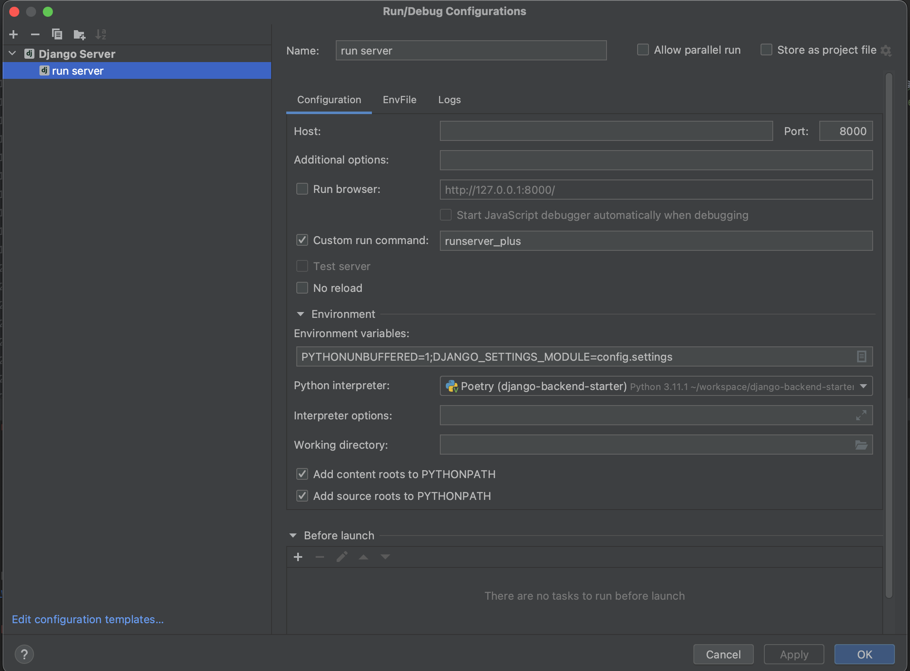

# Pycon2023 Sprints Django 실습 View part [django-auth-server] 구현

[](https://www.python.org/downloads/release/python-3111/)
[](https://www.djangoproject.com/start/overview/)
[](https://mypy-lang.org/)


[](https://github.com/pre-commit/pre-commit)
[](https://github.com/psf/black)
[](https://pycqa.github.io/isort/)


## QuickStart

1. Install Docker Desktop
    ~~~
    https://www.docker.com/products/docker-desktop/
    ~~~

2. Install pyenv

    #### MacOS
    ~~~shell
    brew install pyenv
    ~~~

    #### Window
    ~~~shell
    winget install pyenv # (아직 사용불가)

    # winget에서 pyenv 관리 아직 지원 안됨으로 아래 링크의 pyenv-win#quick-start 메뉴얼을 따라갈것
    https://github.com/pyenv-win/pyenv-win#quick-start
    ~~~

3. Install poetry
    * https://python-poetry.org/docs/#installing-with-the-official-installer
    #### MacOS
    ~~~shell
    curl -sSL https://install.python-poetry.org | python3 -
    ~~~

    #### Window (powershell)
    ~~~shell
    (Invoke-WebRequest -Uri https://install.python-poetry.org -UseBasicParsing).Content | py -
    ~~~

4. Infra 를 컨테이너로 전부 올립니다.
    ```shell
    docker compose -f docker/compose.yaml up -d
    ```

5. Install python using pyenv
    ~~~shell
    pyenv install 3.11.1
    ~~~

6. create virtualenv(venv) using poetry & install library
    ~~~shell
    poetry config virtualenvs.in-project true # true이면 .venv 폴더가 프로젝트 하위에 생성됩니다.
    poetry shell
    poetry install --only=main,dev # sqlite를 사용합니다.(default)

    # 각자 개발환경에 따라 database를 선택하시면 됩니다.
    poetry install --only=main,dev,mysql --sync
    poetry install --only=main,dev,postgresql --sync

    # redis 관련 django 라이브러리 추가설치
    poetry install --only=main,dev,postgresql,redis --sync

    # 파일 처리 관련 django 라이브러리 추가 설치
    poetry install --only=main,dev,file-upload --sync

    ~~~

7. django migration
    * 둘중 하나를 수행합니다.
    ~~~shell
    python apps/manage.py migrate
    ~~~
    * OS와 venv python PYTHONPATH 환경변수 설정에 따라 위 명령어가 수행실패 할 수도 있는데 그런 경우
      "poetry run xxx" 명령어를 통해 PYTHONPATH를 보장받은 상태로 수행하면 됩니다.(위 명령어 실패시 아래 명령어로 재수행할것)
    ~~~shell
    poetry run python apps/manage.py migrate
    ~~~

8. django runserver
    * 서버 실행후 http://localhost:8000/api/docs 로 들어가서 API문서를 확인합니다.
    ~~~shell
    python apps/manage.py runserver 8000
    ~~~
    * 이 경우에도 "7. django migration" 과 마찬가지로 수행 실패시 "poetry run xxx" 를 통해 수행합니다.
    ~~~shell
    poetry run python apps/manage.py runserver 8000
    ~~~
    * 서버를 띄우면 웹브라우저(ex:크롬,사파리,웨일)에서 아래 url로 접근시 API 문서를 조회할 수 있습니다.
      * http://localhost:8000/docs


## Pycharm[Pro] django 프로젝트 세팅



